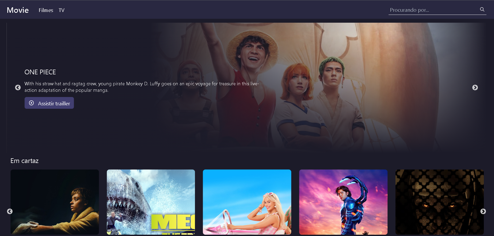

# :desktop_computer: Movie Application

## :briefcase: Stacks

✅ TypeScript/JavaScript
✅ React

## :fire: Run

- Client Development (Port 3000): `yarn dev`

## :triangular_flag_on_post: Environment Variables

### Client Variables

- Server Address: `VITE_SERVER_URL`
- API Key: `VITE_SERVER_KEY`

## :page_facing_up: Docs

- TheMovieDB: [Docs](https://developer.themoviedb.org/docs)